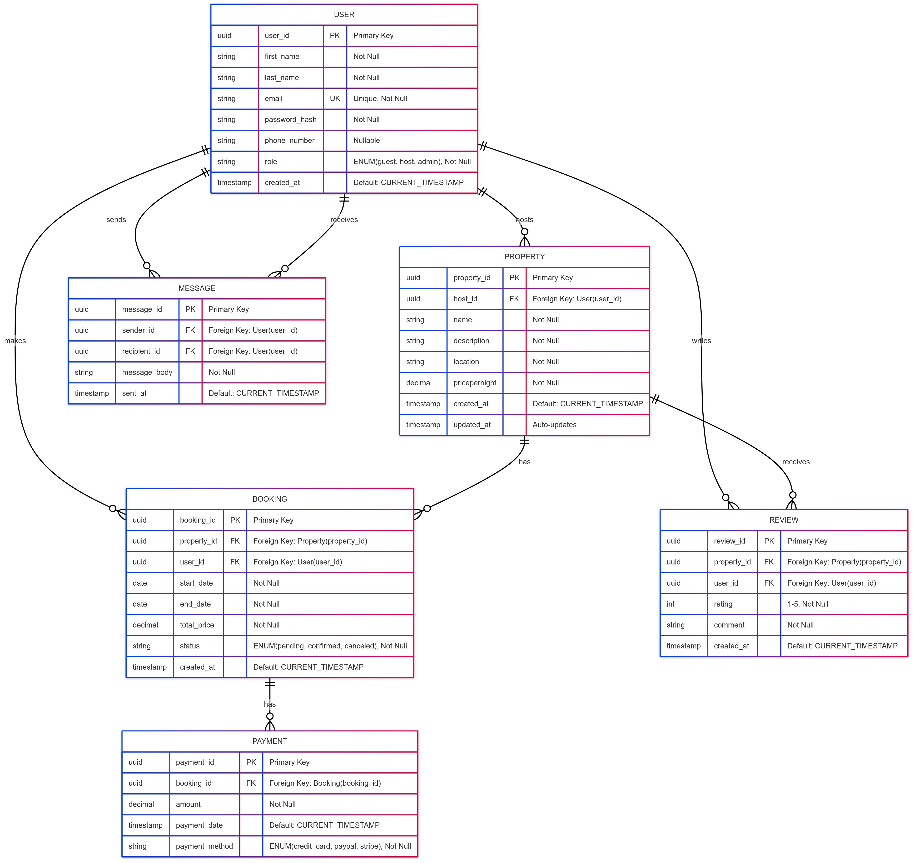

## Database Specification 

**Entities** are objects or simply a noun

### **ENTITIES & ATRRIBUTES**
        
|   **`user`**   |  **`property`**  |   **`booking`**   |  **`payment`**      |  **`review`**    |  **`message`** |
|----------------|------------------|-------------------|---------------------|------------------|----------------|
|  `user_id`     |   `property_id`  |   `booking_id`    |    `payment_id`     |    `review_id`   |  `message_id`  |
|  `first_name`  |   `host_id`      |   `property_id`   |    `booking_id`     |    `property_id` |  `sender_id`   |     
|  `last_name`   |   `name`         |   `user_id`       |    `amount`         |    `user_id`     | `recipient_id` |
|  `email`       | `description`    |  `start_date`     |   `payment_date`    |    `rating`      | `message_body` |
|`password_hash` | `location`       |  `end_date  `     |   `payment_method`  |    `comment`     |   `sent_at`    |
| `phone_number` | `pricepernight`  |  `total_price`    |                     |    `created_at`  |                |
|  `role`        | `created_at`     |  `status`         |                     |                  |                |
|  `created_at`  | `updated_at`     |  `created_at`     |                     |                  |                |

### RELATIONSHIP
- A `property` is associated with a `user`
- A `booking` has `property`
- `payment` is assciated with `booking`
- `review` corresponds with  `property`
- `user` makes a `review`
- `message` is sent by a `user`
- `message` is recieved by `user`

