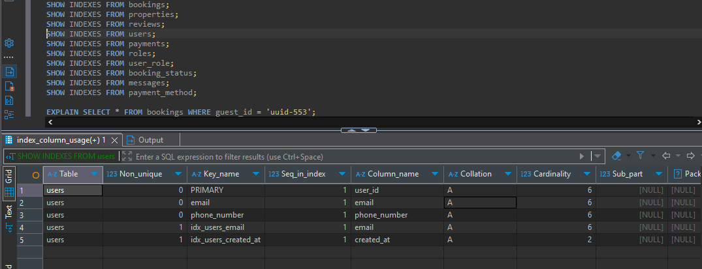
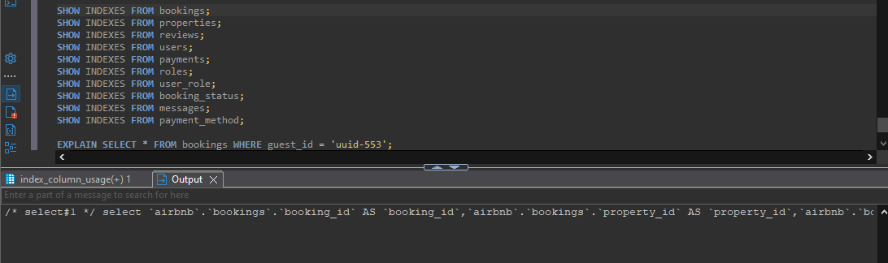

-- Create indexes on high-usage columns for better query performance

-- USERS table: email and created_at are common in filters or sorting
```sql
CREATE INDEX idx_users_email ON users(email);
CREATE INDEX idx_users_created_at ON users(created_at);

-- BOOKINGS table: guest_id, property_id, status_id, start_date, end_date used in JOINs and filters
CREATE INDEX idx_bookings_guest_id ON bookings(guest_id);
CREATE INDEX idx_bookings_property_id ON bookings(property_id);
CREATE INDEX idx_bookings_status_id ON bookings(status_id);
CREATE INDEX idx_bookings_start_date ON bookings(start_date);
CREATE INDEX idx_bookings_end_date ON bookings(end_date);

-- PROPERTIES table: host_id, location, price_per_night commonly used
CREATE INDEX idx_properties_host_id ON properties(host_id);
CREATE INDEX idx_properties_location ON properties(location);
CREATE INDEX idx_properties_price ON properties(price_per_night);

-- REVIEWS table: property_id and reviewer_id frequently queried
CREATE INDEX idx_reviews_property_id ON reviews(property_id);
CREATE INDEX idx_reviews_reviewer_id ON reviews(reviewer_id);
CREATE INDEX idx_reviews_rating ON reviews(rating);

-- MESSAGES table: sender and recipient are often filtered or joined
CREATE INDEX idx_messages_sender_id ON messages(sender_id);
CREATE INDEX idx_messages_recipient_id ON messages(recipient_id);

-- PAYMENTS table: booking_id and method_id frequently accessed
CREATE INDEX idx_payments_booking_id ON payments(booking_id);
CREATE INDEX idx_payments_method_id ON payments(method_id);

-- To evaluate query performance before and after:
Run EXPLAIN or EXPLAIN ANALYZE on your target queries, e.g.
EXPLAIN SELECT * FROM bookings WHERE guest_id = 'uuid-553';
```

## RESULTS 



