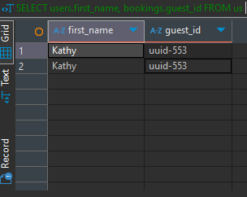
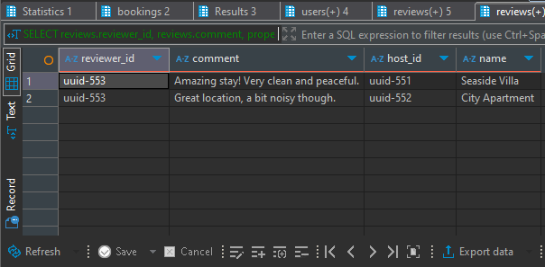
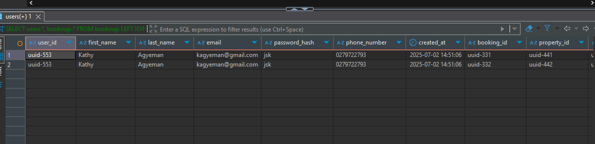

# Airbnb SQL JOIN Operations

This document provides detailed explanations and usage of various SQL JOIN operations performed on an Airbnb-like database using **MySQL**.

## Attributes

- `users`: contains user information (guests and hosts)
- `bookings`: contains booking records with `guest_id` referencing `users.user_id`
- `properties`: contains property listings with `host_id` referencing `users.user_id`
- `reviews`: contains reviews for properties, linked via `property_id`


## TASK 1- Perform INNER JOIN on Bookings and Their Respective Users

###  Query:
```sql
SELECT users.first_name, bookings.guest_id
FROM users
INNER JOIN bookings ON users.user_id = bookings.guest_id;
```

### ✅ Purpose:
- Retrieves **only** the users who have made bookings.
- Combines data from `users` and `bookings` where `users.user_id = bookings.guest_id`.

### What You Get:
- Each row contains the user's first name and the ID used in the booking.
- If a user **has no bookings**, they are **excluded**.

**image**


## 2. LEFT JOIN Properties to Reviews

###  Query:
```sql
SELECT reviews.reviewer_id, reviews.comment, properties.host_id, properties.name
FROM properties
LEFT JOIN reviews ON properties.property_id = reviews.property_id;
```

###  ✅ Purpose:
- Retrieves **all properties**, whether they have reviews or not.
- If a property has no reviews, the `reviewer_id` and `comment` will be `NULL`.

### What You Get:
- A list of property names, their host IDs, and any associated reviews.
- Useful for identifying properties that haven't been reviewed yet.

**image**



## 3. Simulate FULL OUTER JOIN (Not Natively Supported in MySQL)

MySQL does **not** support `FULL OUTER JOIN`. To mimic its behavior, combine a `LEFT JOIN` and a `RIGHT JOIN` using `UNION`.

### Query:
```sql
-- LEFT JOIN: All bookings with user info if available
SELECT users.*, bookings.*
FROM bookings
LEFT JOIN users ON users.user_id = bookings.guest_id

UNION

-- RIGHT JOIN: All users with booking info if available
SELECT users.*, bookings.*
FROM users
RIGHT JOIN bookings ON users.user_id = bookings.guest_id;
```

### ✅ Purpose:
- Returns **all users** and **all bookings**:
  - Users with or without bookings
  - Bookings with or without matching user accounts

### What You Get:
- A complete picture of user-booking relationships.
- Helps spot orphaned bookings or inactive users.

**image**


## 📌 Summary of JOIN Types Used

| JOIN Type       | Description                                                                 |
|-----------------|-----------------------------------------------------------------------------|
| `INNER JOIN`     | Matches rows in both tables only when a condition is met.                   |
| `LEFT JOIN`      | Returns all rows from the left table and matched rows from the right table. |
| `RIGHT JOIN`     | Returns all rows from the right table and matched rows from the left table. |
| `FULL OUTER JOIN`| Not supported in MySQL, simulated using `UNION` of `LEFT` and `RIGHT` joins.|

---

## 💡 Tips

- Always check your join keys (`user_id`, `guest_id`, `property_id`) to avoid logic errors.
- Use `IS NULL` after a LEFT JOIN to find unmatched records (e.g., properties with no reviews).
- For large datasets, consider using `EXPLAIN` to inspect query performance.

---

## 🛠️ Example Use Cases

- List all properties with or without reviews ✅
- Find users who haven't made any bookings ❌
- Merge all users and bookings for reporting 🧾
