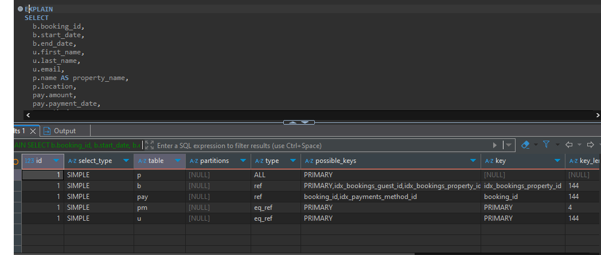
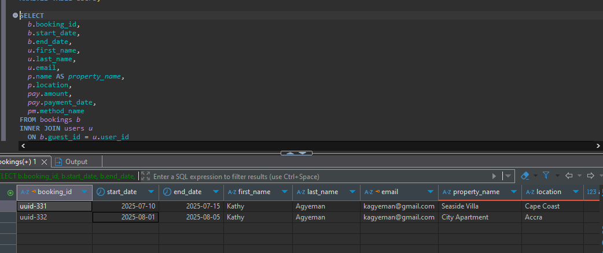

# 📈 Query Optimization Report: Booking Details Retrieval

## 🎯 Objective

Optimize a multi-table SQL query to efficiently retrieve booking information along with corresponding user details, property details, and payment details.

---

## 📄 Original Query

```sql
EXPLAIN
SELECT
  b.booking_id,
  b.start_date,
  b.end_date,
  u.first_name,
  u.last_name,
  u.email,
  p.name AS property_name,
  p.location,
  pay.amount,
  pay.payment_date,
  pm.method_name
FROM bookings b
JOIN users u
  ON b.guest_id = u.user_id
JOIN properties p
  ON b.property_id = p.property_id
    AND p.price_per_night > 0 -- 🟢 Filter included inside the JOIN
JOIN payments pay
  ON b.booking_id = pay.booking_id
JOIN payment_method pm
  ON pay.method_id = pm.method_id
WHERE b.start_date >= '2024-01-01';
```

## Results


### ⚠️ Issues

- Filtering `p.price_per_night > 0` within the `JOIN` clause may reduce clarity and hinder index usage.
- Generic `JOIN` usage without explicitly declaring `INNER JOIN`.
- Redundant logic inside join statements may affect performance readability.

---

## ✅ Refactored Query

```sql
SELECT
  b.booking_id,
  b.start_date,
  b.end_date,
  u.first_name,
  u.last_name,
  u.email,
  p.name AS property_name,
  p.location,
  pay.amount,
  pay.payment_date,
  pm.method_name
FROM bookings b
INNER JOIN users u
  ON b.guest_id = u.user_id
INNER JOIN properties p
  ON b.property_id = p.property_id
INNER JOIN payments pay
  ON b.booking_id = pay.booking_id
INNER JOIN payment_method pm
  ON pay.method_id = pm.method_id
WHERE
  b.start_date >= '2024-01-01'
  AND p.price_per_night > 0;  -- ✅ Filter moved to WHERE clause
```

---

## 🔧 Optimization Strategies Applied

| Change | Description |
|--------|-------------|
| `INNER JOIN` | Used instead of ambiguous `JOIN` for clarity. |
| Filter relocation | Moved `p.price_per_night > 0` from `JOIN` clause to `WHERE` clause. |
| Filtering `b.start_date` | Reduces result set size early, improving performance. |

---

## 🧠 Indexing Recommendations

```sql
-- BOOKINGS table indexes
CREATE INDEX idx_bookings_guest_id ON bookings(guest_id);
CREATE INDEX idx_bookings_property_id ON bookings(property_id);
CREATE INDEX idx_bookings_start_date ON bookings(start_date);

-- PAYMENTS table indexes
CREATE INDEX idx_payments_booking_id ON payments(booking_id);
CREATE INDEX idx_payments_method_id ON payments(method_id);

-- PROPERTIES table indexes
CREATE INDEX idx_properties_price ON properties(price_per_night);
```

## Results

---

## 📊 Performance Insights with EXPLAIN

Use the `EXPLAIN` keyword to analyze the query plan and ensure the use of indexes, reduced scanned rows, and more efficient join strategies.

```sql
EXPLAIN SELECT ...
```

Monitor:
- Type of join (e.g., `ref`, `index`, `ALL`)
- Estimated number of rows
- Index usage (`key` column)

---

## 📌 Conclusion

The refactored query improves both readability and performance:
- Uses proper `INNER JOIN`
- Filters placed in appropriate `WHERE` clause
- Supported by necessary indexes for efficient access

By following these optimization steps, execution time and resource usage are reduced, especially on large datasets.

---

## 📥 Next Steps

- Benchmark using `EXPLAIN ANALYZE`
- Regularly monitor query performance as data grows
- Maintain and update indexes as needed

